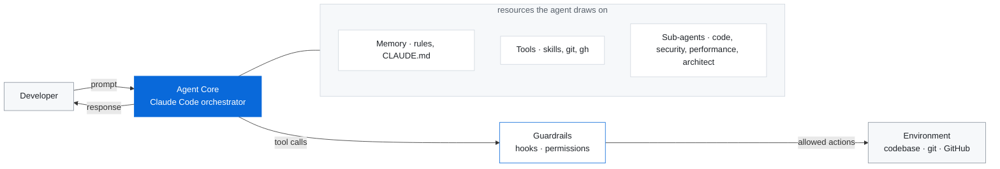

# clik

A complete Claude Code setup you enable **once** and get in **every** project: specialist review agents, workflow skills, and safety/format hooks. Then run `/clik` in any repo to tailor its `CLAUDE.md`, rules, and tooling to what that project actually is — generic by default, or CUDA / data-viz / ML / web / backend / systems on request.

Two layers:

- **Global layer** — the `clik` plugin, enabled at user scope, ships every skill, agent, and hook to every project automatically. No per-project copying.
- **Per-project layer** — `/clik [context]` writes a lean, tailored `CLAUDE.md` + rules + permissions for the repo you're in.

## Install (once, for all projects)

In Claude Code:

```
/plugin marketplace add krish-shahh/clik
/plugin install clik@clik
```

Choose **user** scope when prompted so it applies to every project. Restart Claude Code once.

Or set it declaratively in `~/.claude/settings.json`:

```json
{
  "extraKnownMarketplaces": {
    "clik": { "source": { "source": "github", "repo": "krish-shahh/clik" } }
  },
  "enabledPlugins": ["clik@clik"]
}
```

That alone gives you — in every project — all the skills, the `@code-reviewer` / `@security-reviewer` / `@architect` agents, and hooks that block dangerous commands, scan for secrets, protect sensitive files, and auto-format on save.

### Recommended: secret-protection at user scope

Plugins can't ship permission rules, so add the universal secret `deny` block to `~/.claude/settings.json` once (covers every project):

```json
{
  "permissions": {
    "deny": [
      "Read(**/.env)", "Read(**/.env.*)", "Read(**/secrets/**)", "Read(**/*.pem)", "Read(**/*.key)",
      "Write(**/.env)", "Write(**/.env.*)", "Write(**/secrets/**)", "Write(**/*.pem)", "Write(**/*.key)",
      "Edit(**/.env)", "Edit(**/.env.*)", "Edit(**/secrets/**)", "Edit(**/*.pem)", "Edit(**/*.key)"
    ]
  }
}
```

## Tailor a project: `/clik`

`/clik` takes a **freeform context string** describing the project. With no argument it auto-detects the stack and applies generic defaults; with context it adapts the commands, rules, conventions, and tooling to that domain — so you're never stuck with `npm`-shaped defaults on a CUDA project.

```
/clik                                          # detect stack, generic setup
/clik cuda kernels, profiled with nsight, runs on a remote A100 cluster
/clik streamlit data-viz dashboard
/clik fastapi service with postgres + alembic
/clik rust CLI, no_std embedded target
```

It writes a tight `CLAUDE.md` (real build/test/lint commands for your toolchain), the relevant `.claude/rules/`, and accurate `permissions`. The context string wins over auto-detection when they disagree — you know your project.

There's no recipe library — `/clik` reasons from your context string plus the actual project and decides directly: a CUDA project gets `nvcc`/`compute-sanitizer`/`ncu` commands and a kernel-safety rule; a data-viz project gets notebook/figure commands and reproducibility rules; a Rust service gets `cargo`/clippy and an error-handling rule. The skill carries a short "what good tailoring looks like" checklist (real commands, scoped rules, encode the non-obvious gotchas, drop what doesn't apply) — not a static profile per domain to maintain.

## Skills

Split by who can invoke them, same convention as most Agent Skills libraries. **User-invoked** skills only run when you type `/name` — they orchestrate. **Model-invoked** skills can also be reached for automatically when the task fits, or invoked directly — they're the reusable discipline layer other skills lean on.

### User-invoked

| Command | Args | Description |
|---|---|---|
| `/clik` | `[context]` | Tailor this project's CLAUDE.md, rules, and permissions to its domain. |
| `/init-project` | `[repo URL]` | Create/connect a GitHub repo, scaffold `CLAUDE.md`, commit and push. |
| `/idea-refine` | `[rough idea]` | Diverge then converge a vague idea into a concrete proposal. |
| `/spec` | `[feature/project name]` | Write a PRD — objectives, scope, structure, conventions, testing, boundaries. |
| `/plan` | `[spec file \| feature]` | Decompose a spec into small, verifiable tasks with acceptance criteria and dependency order. |
| `/grill-with-docs` | — | A `/grilling` session that also builds the domain glossary (`CONTEXT.md`) and ADRs as it goes. |
| `/start-issue` | `[issue #] [--worktree]` | Create `feature/issue-N-slug`, update `## Active Issue`. `--worktree` works the issue in an isolated git worktree. |
| `/overseer` | `[task/issue description]` | Match the task against a small `@`-referenced policy table and decide what applies — TDD, `@architect`, `/doubt`, `/pr-review`, etc. — instead of leaving it to memory. Run after `/start-issue` and again before `/done`/`/ship`. |
| `/triage` | — | Move issues and external PRs through a state machine of triage roles. |
| `/wayfinder` | — | Plan work bigger than one session as a shared map of decision tickets on the issue tracker. |
| `/done` | — | Check ACs against the diff, post completion comment, close issue, open PR. |
| `/pr-review` | `[PR #, "staged", file]` | Review via specialist agents in parallel; unified severity-ranked report. |
| `/doubt` | `[decision/claim]` | Adversarial CLAIM → EXTRACT → DOUBT → RECONCILE stress-test of an in-flight decision. |
| `/tdd` | `[feature]` | Strict red-green-refactor loop, commit after each cycle. |
| `/refactor` | `[target]` | Safe refactor with tests as a net; never mixes refactor with behavior change. |
| `/debug-fix` | `[issue/error] [--fast]` | Reproduce → investigate → regression test → fix. `--fast` = hotfix mode. |
| `/improve-codebase-architecture` | — | Scan for module-deepening opportunities, present an HTML report, then grill through the one you pick. |
| `/adr` | `[decision title]` | Write an Architecture Decision Record for a significant technical decision. |
| `/deprecate` | `[API/module/system]` | Mark deprecated, migrate callers, remove on a set timeline. |
| `/ship` | `[msg]` | Stage, commit (skipping secrets), push, open PR — confirmed at each step. Gates React projects on a react-doctor score ≥95. |
| `/setup-ci` | — | Scaffold a GitHub Actions CI for the detected stack. |
| `/deploy` | `[vercel\|railway\|fly\|render]` | Detect stack, scaffold config, walk env-var checklist, deploy. |
| `/standup` | `[hours]` | Standup from git + GitHub activity. Default 24h. |
| `/story` | `[feature\|PR #\|project] [client scope]` | Frame a feature, PR, or the project into a customer demo story. |
| `/handoff` | `[what's next]` | Compact the current conversation into a handoff doc for the next session. |
| `/show-me-your-work` | — | TSV decision-trail log (what/why/evidence/result) for long-running or unattended work. |

### Model-invoked

Reach for these directly too, but they're also auto-triggered when the task fits.

| Command | Description |
|---|---|
| `/grilling` | Relentless one-question-at-a-time interrogation to stress-test a plan or decision. |
| `/domain-modeling` | Sharpen the project's ubiquitous language and record decisions in `CONTEXT.md`/ADRs as they crystallize. |
| `/codebase-design` | Shared vocabulary for deep modules — interface, seam, depth — for finding or evaluating a clean boundary. |
| `/prototype` | Build a throwaway prototype (terminal app or toggleable UI variants) to settle a design question empirically. |
| `/resolving-merge-conflicts` | Work an in-progress merge/rebase conflict hunk by hunk, resolving by intent — never `--abort`. |
| `/blast-radius` | Prove what a change could break beyond the diff by running real code, not writing a convincing paragraph. |
| `/test-writer` | Comprehensive tests for new or changed code. |

> **Platform tooling is intentionally out of scope.** Vercel, Supabase, shadcn, Stripe, etc. are better served by the official Anthropic/vendor plugins and MCP servers. clik tailors your project's config and ships the review/workflow kit — it doesn't reinvent platform integrations.

### How `/overseer` stays current

No generated index to fall out of sync — `/overseer`'s policy table `@`-references the real skill and agent files directly (`@../tdd/SKILL.md`, `@../../agents/architect.md`, etc.), the same `@path` convention used in `CLAUDE.md`/`AGENTS.md` imports. A reference can't drift from what it points at because it isn't a copy of anything.

## Agents

Auto-delegated by skills, or invoke directly with `@name`.

| Agent | Used for |
|---|---|
| `@architect` | Implementation plan before coding a complex feature. |
| `@code-reviewer` | Off-by-ones, null derefs, logic bugs, race conditions, error gaps. |
| `@security-reviewer` | Injection, auth, data exposure, crypto, input validation. |
| `@performance-reviewer` | N+1s, leaks, blocking I/O, re-renders, lock contention. |
| `@frontend-designer` | Production UI with design tokens, a11y, no generic AI aesthetics. |
| `@doc-reviewer` | Docs vs source drift, stale refs, missing params. |
| `@sales-engineer` | Turns built software into a customer-ready demo story, tailored to a client scope. |

## Rules

Modular, mostly path-scoped so they only cost tokens near matching files: `code-quality`, `testing`, `context-engineering` (always-on), and `error-handling`, `security`, `database`, `observability`, `frontend`, `api-design`, `sales-engineering` (path-scoped). `/clik` selects and path-tunes the relevant ones per project.

## Hooks

Ship in the plugin (`plugins/clik/hooks/hooks.json`) and fire in every project once enabled:

| Hook | Event | Does |
|---|---|---|
| `protect-files` | PreToolUse Edit/Write | Block edits to secrets, keys, lockfiles, generated files. |
| `scan-secrets` | PreToolUse Edit/Write | Detect credentials in file content. |
| `warn-large-files` | PreToolUse Edit/Write | Block writes to build artifacts and binaries. |
| `block-dangerous-commands` | PreToolUse Bash | Block push-to-main, force push, `rm -rf /`, `DROP TABLE`, `curl \| sudo`. |
| `format-on-save` | PostToolUse Edit/Write | Auto-format (Prettier/Black/Ruff/Biome/rustfmt/gofmt). |
| `session-start` | SessionStart | Branch + dirty state, active issue body. |

## Repo layout

Single source of truth at the root; `scripts/sync-plugins.sh` generates the plugin folders (CI enforces they stay in sync).

```
clik/
├── .claude-plugin/marketplace.json   # marketplace catalog
├── agents/        # source: specialist subagents
├── skills/        # source: slash-command skills (incl. the clik/ setup skill)
├── rules/         # source: modular rules
├── hooks/         # source: hook scripts + git/post-commit + tests/
├── plugins/clik/  # generated: the one comprehensive plugin (skills+agents+hooks+template)
└── scripts/sync-plugins.sh
```

## Requirements

- **Claude Code** with `gh` authenticated (`gh auth login`)
- `jq` — `brew install jq` / `apt install jq` (used by hooks)

## License

MIT. Use it, fork it, adapt it. See [LICENSE](LICENSE).

## Architecture

clik is a **control stack** around the model — context & memory, tools, bounded sub-agents, and deterministic guardrails between the agent and your codebase.



The **Agent Core** (Claude Code) draws on three resource planes — **Memory** (rules and `CLAUDE.md`), **Tools** (skills + CLIs), and **Sub-agents** (specialist reviewers in isolated context, whose findings are adversarially verified). Every action it takes passes through **Guardrails** — hooks and permissions that enforce safety deterministically — before it touches your repo.
